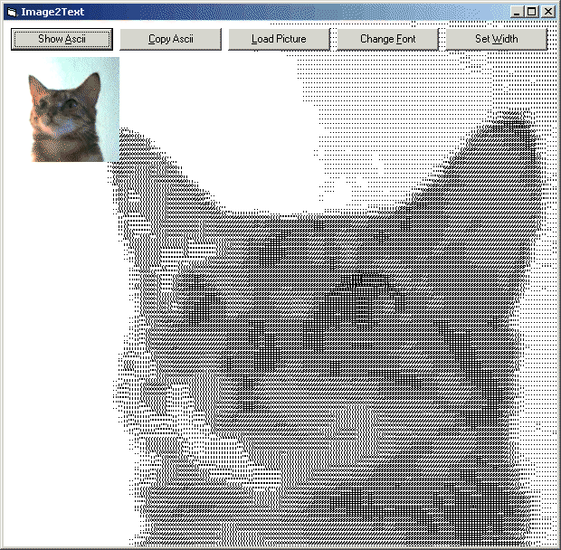



## Image2Text

### Description

Use _ANY_ (fixed width) font to create ASCII art. The code will scan the font and your picture to create the optimal ASCII image. The screenshot shows it all. The code is commented, but here is some explanation. You choose a picture and a font (Courier / Terminal / Lucida Console) and a font size. The code will create an array for all 255 grey values that maps to a character in your font. This is done by printing each character and 'scanning' it with GetPixel. After this the picture is scanned and the ASCII art - string is created. The code is fast and can be used on larger pictures, even without compiling. Leave a vote, (or better: a comment) if you like it. (updated 2/19/2003)
 
### More Info
 

             |
---                |---
**Submitted On**   |2003-02-19 00:56:02
**By**             |[Martijn B](https://github.com/Planet-Source-Code/PSCIndex/blob/master/ByAuthor/martijn-b.md)
**Level**          |Advanced
**User Rating**    |5.0 (55 globes from 11 users)
**Compatibility**  |VB 6\.0
**Category**       |[Graphics](https://github.com/Planet-Source-Code/PSCIndex/blob/master/ByCategory/graphics__1-46.md)
**World**          |[Visual Basic](https://github.com/Planet-Source-Code/PSCIndex/blob/master/ByWorld/visual-basic.md)
**Archive File**   |[Image2Text1547182192003\.zip](https://github.com/Planet-Source-Code/martijn-b-image2text__1-43325/archive/master.zip)

